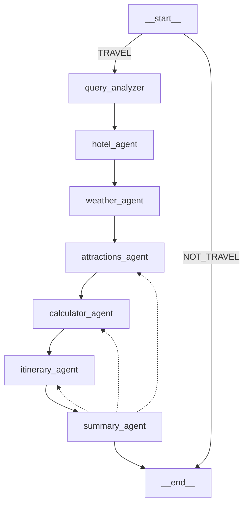

# AI Travel Agent & Expense Planner

This project is an AI-powered travel agent that helps users plan trips to any city worldwide. It provides real-time information, generates a complete itinerary, and calculates expenses—all in a single automated workflow.

## Core Architecture

- **`workflow.py`**: Contains the LangGraph StateGraph implementation. The workflow is a directed graph of nodes (agents) that process the user's request step by step:
  - QueryAnalyzer → HotelAgent → WeatherAgent → AttractionsAgent → CalculatorAgent → ItineraryAgent → SummaryAgent
  - Each node is a function that updates the shared state and routes to the next node.
- **`services/`**: Modular Python classes, each responsible for a specific task (e.g., fetching weather, finding attractions, hotel search, currency conversion, calculations). These are the "tools" our agents use.
- **`models.py`**: Pydantic data models (`TripPlan`, `QueryAnalysisResult`, `WorkflowState`, `HotelInfo`) ensure structured and validated data flows through the system.
- **`requirements.txt`**: Lists all project dependencies.
- **`.env`**: Stores sensitive information like API keys. (Note: create this file from `.env.example`).

## Workflow Diagram

The workflow is visualized as a directed graph:

A PNG version of this diagram is also saved in the repository as `workflow.png`.

## Markdown Exporter

A `MarkdownExporter` utility allows you to export the agent's step-by-step reasoning and the final summary to a well-formatted Markdown file. This includes metadata, a disclaimer, and a timestamp. The exporter can be used programmatically to save the agent's output for sharing or documentation.

## Usage

- Run the workflow from `workflow.py` (see the bottom of the file for CLI/manual testing example).
- Provide your travel query (e.g., "I want to go to Paris for 3 days, my budget is 1000 EUR, I like art and culture, my currency is USD").
- The workflow will process your request, fetch hotels, weather, attractions, calculate costs, build an itinerary, and summarize the plan.
- You can export the plan to Markdown using the MarkdownExporter.

## Outdated Code

- The README and codebase no longer reference `PlanModifier` or `TravelWorkflow` classes. The workflow is now managed by a StateGraph in `workflow.py`.
- All agent logic is node-based and modular.

## Additional Notes

- All services are modular and can be extended or replaced.
- The workflow is fully stateful and supports stepwise refinement.
- For CLI/manual testing, see the bottom of `workflow.py`.
